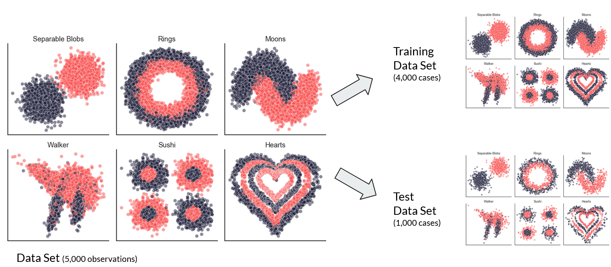
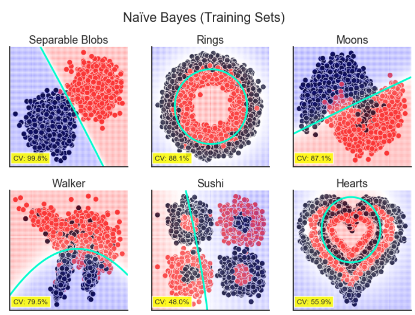
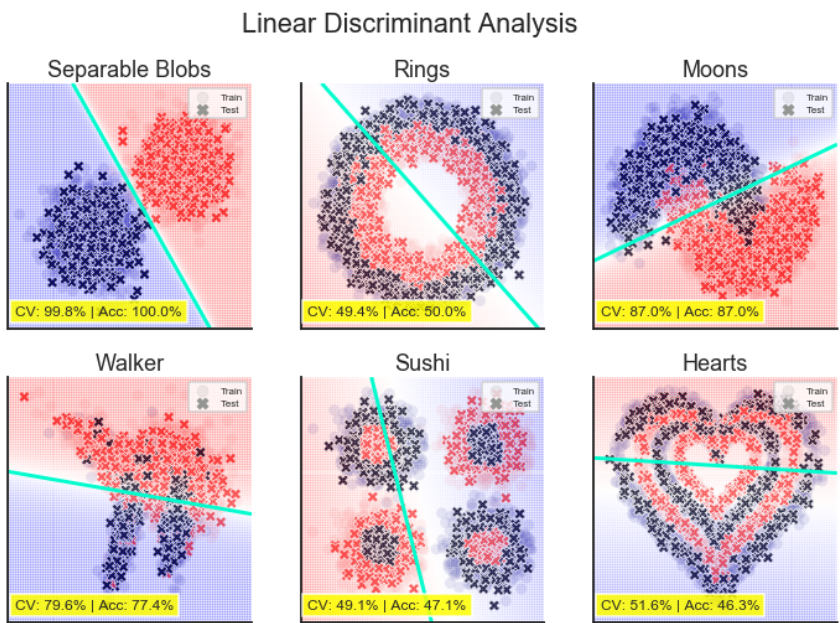
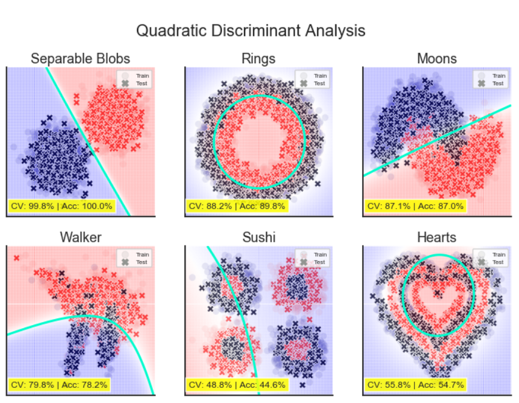
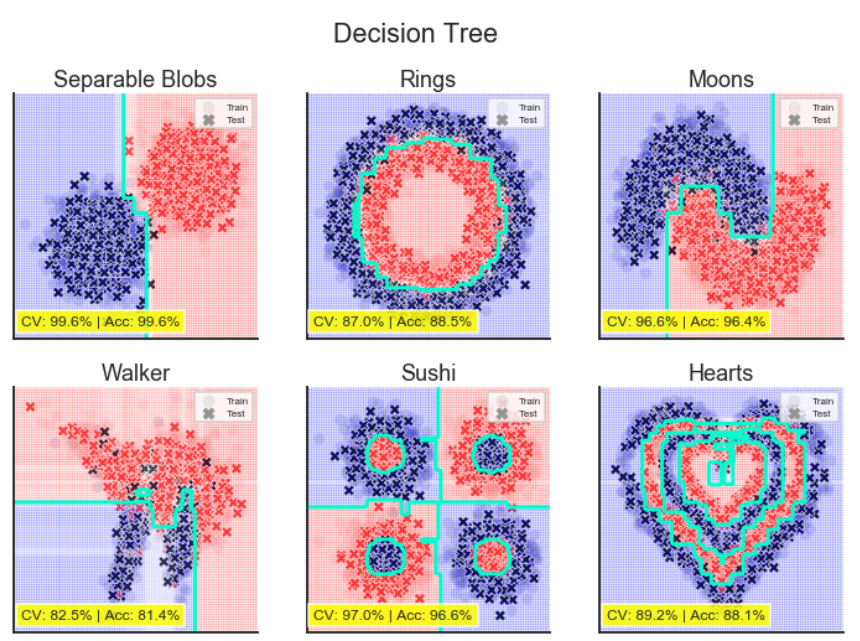
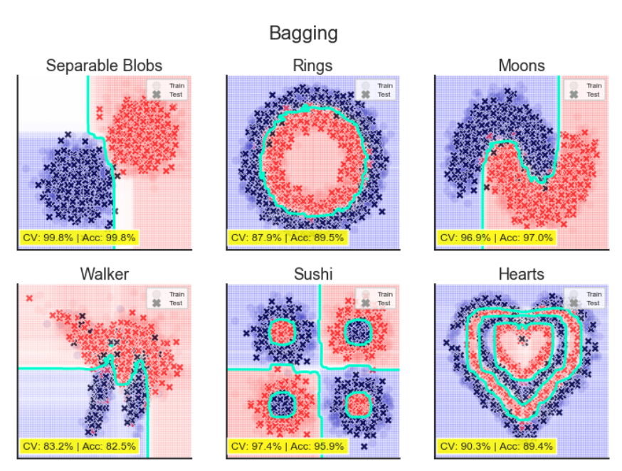
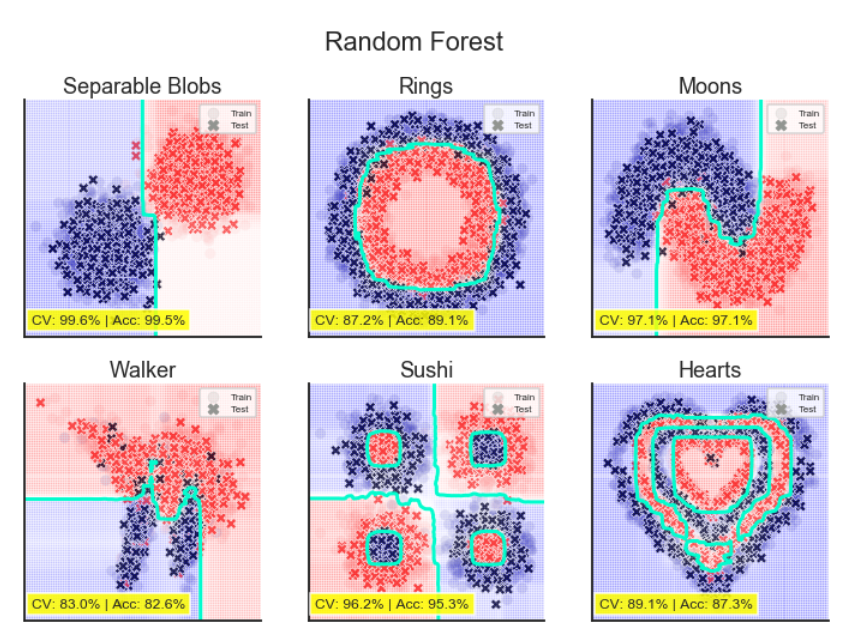
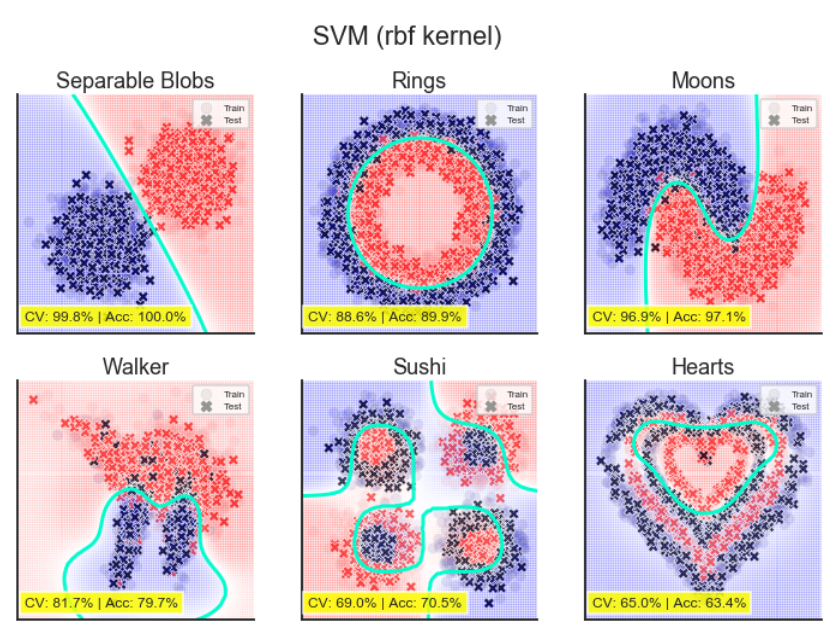

<style>
img[alt~="center"] {
  display: block;
  margin: 0 auto;
}
</style>


# Production: Model Development

```code
$ echo "Data Science Institute"
```
---

# Agenda: 5.1 Model Development and Offline Evaluation

- Model Development and Training 
- Ensembles 
- Experiment Tracking and Versioning 
- Distributed Training
- AutoML 
- Model Offline Evaluation 

---

# Agenda: 5.2 Experiment Tracking

- Observability and telemetry
- Docker and Portability
- Experiment Tracking in Python
- Experiment Components

---

## About

- These notes are based on Chapter 6 of [*Designing Machine Learning Systems*](https://huyenchip.com/books/), by [Chip Huyen](https://huyenchip.com/).


---

# Our Reference Architecture

---

## The Flock Reference Architecture


<center>Agrawal et al (2019)</center>

---

# Exploring the Hypothesis Space

---

> “A classifier must be represented in some formal language that the computer can handle. Conversely, choosing a representation for a learner is tantamount to choosing the set of classifiers that it can possibly learn. This set is called the hypothesis space of the learner. If a classifier is not in the hypothesis space, it cannot be learned.” (Domingos, 2012)

---

## Data Set Description



---

## Naïve Bayes

+ Conditional probability using Bayes’ Theorem.
+ Assume conditional independence

$$
\begin{aligned}
P(C|x_1,x_2) = \frac{P(x_1, x_2|C) \cdot P(C)}{P(x_1,x_2)} \\
\approx \frac{P(x_1|C) \cdot P(x_2|C) \cdot P(C)}{P(x_1,x_2)}
\end{aligned}
$$



---

## Discriminant Analysis

Discriminant Analysis methods find regions in feature space that:
+ Minimize the distance within groups.
+ Maximizes the distance between groups.

Linear Discriminant Analysis (LDA): 
+ Assumes attributes are normally distributed.
+ Classes share covariance matrix.



---

## Discriminant Analysis


Quadratic Discriminant Analysis (QDA): 
+ Classes do not share covariance matrix.




---

## Logistic Regression

+ Builds a linear model based on

$$
log\left(\frac{P(C|x_1,x_2)}{1-P(C|x_1,x_2)}\right)
$$

+ The resulting model has the form:

$$
P(C|x_1,x_2) = \frac{1}{1+exp(-w_0-w_1x_1-w_2x_2)}
$$


---

## Unregularized Decision Trees

+ Divide-and-conquer strategy: segment data based on an attribute such that information gain is maximized. 
+ Information can be measured with Gini coefficient or entropy.
+ Fully expanded decision trees often contain unnecessary structure.


---

## Regularized Decision Trees

+ Pre-pruning: during training, decide which branches to stop developing.
+ Post-pruning: subtree replacement involves training a full tree, then decide if a branch can be substituted by a leaf node.
+ Constrain tree depth or number of examples in leaf nodes (hyperparameters).





---

## Ensemble Methods: Bagging

+ Bagging = Bootstrap + Aggregation
### Bootstrap
+ Create subsets of data by sampling with replacement; train decision trees on each subset.

### Aggregation

+ Average predictions (regression) or add votes (classification).



---

## Ensemble Methods: Random Forest

### Bootstrap

+ Create subsets of data by sampling with replacement.
+ Create subsets of features.
+ Train Decision Tree Model (weak learner) on each subset.

### Aggregation
+ Average predictions or vote.



---

## Support Vector Machines (1/2)

+ Support vectors: The model selects a small number of critical boundary instances from each class.
+ Builds a linear discriminant function that separates classes with a margin that is as wide as possible, the maximum margin hyperplane.


---

## Support Vector Machines (2/2)

SVM use linear models to implement non-linear boundaries by performing a non-linear mapping of inputs:
- Polynomial
- Radial Basis Function
- Sigmoid




---

## Neural Net

+ Combine simple perceptron-like models in a hierarchical structure.
+ Use (mostly) differentiable activation functions such as sigmoid or ReLU, such that gradient-based optimization can be applied.


---

# Model Development and Training 

---

## Evaluating ML Models

- Evaluating ML models in production is a multidimensional problem.
- Model performance (of course) is important, but so are how long it takes to train, latency at inference, (cost of) compute requirements, and explainability.
- Different types of algorithms require different numbers of labels as well as different amounts of computing power.
- Some take longer to train than others, whereas some take longer to make predictions.

---

## Guidance for Model Selection (1/3)

### Avoid the state-of-the-art trap
- Researchers evaluate models in academic settings: if a model is state-of-the-art, it performs better than existing models on some static dataset.
- It is essential to remain up to date but solve the problem first.
- Start with the simplest models
- Simple is better than complex: easier to deploy, easier to understand, and serve as a baseline.
- Easier to deploy: speeds up the experimentation cycle.
- Easier to understand: adds complexity as needed.
- Baseline: simple models serve as a starting comparison point for model development.

---

## Guidance for Model Selection (1/3)


<center>State of the Art Model Performance on ImageNet c.2023 (paperswithcode.com)</center>

---

## Guidance for Model Selection (2/3)

### Avoid human biases in selecting models
- Human biases can be introduced throughout the model development process.
- Experiment methodically and store results.
- Any model has three components: algorithmic logic, code, and data.


<!-- Learning Curves ( [scikit-learn.org](https://scikit-learn.org/stable/auto_examples/model_selection/plot_learning_curve.html) ) -->

---

## Guidance for Model Selection (2/3)

### Evaluate good performance now versus good performance later
- Using learning curves is a simple way to estimate how your model's performance might change with more data.
- While evaluating models, consider their potential for improvement and how easy/difficult it is to achieve.


<!-- Learning Curves ( [scikit-learn.org](https://scikit-learn.org/stable/auto_examples/model_selection/plot_learning_curve.html) ) -->

---

## Guidance for Model Selection (3/3)

### Evaluate trade-offs
- False positives vs false negatives: reducing false positives may increase false negatives and vice versa.
- Compute requirement and model performance: a more complex model may deliver better performance, but at what cost?

---

## Guidance for Model Selection (3/3)

### Understand your model's assumptions
- Every model comes with its assumptions.
- Prediction assumption: every model that aims to predict an output Y from an input X assumes that it is possible to predict Y based on X.
- Independent and Identically Distributed: neural nets assume that examples are independent and identically distributed.
- Smoothness: supervised learning models assume that a set of functions can transform inputs into outputs such that similar inputs are transformed into similar outputs. If an input X produces Y, then an input close to X would produce an output proportionally close to Y.
- Linear boundaries, conditional independence, normally distributed, and so on.

---

# Ensembles 

---

## The Wisdom of the Crowds

> “Aggregating the judgment of many consistently beats the accuracy of the average member of the group, and is often as startlingly accurate […] In fact, in any group there are likely to be individuals who beat the group. But those bull’s-eye guesses typically say more about the power of luck […] than about the skill of the guesser. That becomes clear when the exercise is repeated many times.” (Tetlock and Gardner, 2015)

---

## Ensembles 

- Ensemble methods are less favoured in production because ensembles are more complex to deploy and harder to maintain. 
- Common in tasks where small performance boosts can lead to substantial financial gains, such as predicting the click-through rate for ads.
- Ensembles perform better when underlying classifiers are uncorrelated. 


<!-- Top Solutions on SQuAD 2.0 ( [source](https://rajpurkar.github.io/SQuAD-explorer/) ) -->

---

## Possible Outcomes

|Outputs of three models |Probability |Ensemble’s output|
|------------------------|------------|-----------------|
|All three are correct |0.7 * 0.7 * 0.7 = 0.343 |Correct|
|Only two are correct |(0.7 * 0.7 * 0.3) * 3 = 0.441 |Correct|
|Only one is correct |(0.3 * 0.3 * 0.7) * 3 = 0.189 |Wrong|
|None are correct |0.3 * 0.3 * 0.3 = 0.027 |Wrong|

---

## Bagging (1/2)

- Bagging (bootstrap aggregating) is designed to improve ML algorithms' training stability and accuracy.
- Reduces variance and helps avoid overfitting; it improves unstable methods (e.g., tree-based methods)
- Sampling with replacement ensures that each bootstrap is created independently from its peers. 


<!-- (Huyen, 2021) -->

---

## Bagging (2/2)

- Given a data set, create n data sets by sampling with replacement (bootstrap).
- Train a classification or regression model on each bootstrap.
- If classification, decide by majority vote; if regression, use the mean result.


<!-- (Huyen, 2021) -->

---

## Boosting (1/2)

- Family of iterative ensemble algorithms that convert weak learners to strong ones.
- Examples: Gradient Boosting Machine (GBM), XGBoost, and LightGBM.


<!-- (Huyen, 2021) -->

---

## Boosting (2/2)


- Each learner is trained on the same set of samples, but the samples are weighted differently in each iteration.
- Future weak learners focus more on the examples that previous weak learners misclassified.


<!-- (Huyen, 2021) -->

---

## Stacking


- Create base learners from the training data.
- Create a meta-learner that combines the outputs of the base learners to output predictions.


<!-- (Huyen, 2021) -->

---

## Experiment Tracking and Versioning 

---

## Experiment Tracking

- The process of tracking the progress and results of an experiment is called experiment tracking.
- ML Flow and Weights & Balances are experiment tracking tools.
- At a minimum, track performance (loss) and time (speed).
- Values over time of any parameter and hyperparameter whose changes can affect model performance.

---

## Experiment Tracking

- Model performance metrics: on all nontest splits, like accuracy, F1, and perplexity.
- Loss curve: train split and each of the eval splits.
- Log of corresponding sample, prediction, and ground truth labels. 
- Speed of the model: number of steps per second or tokens processed per second.
- System performance metrics: memory, CPU, GPU.

---

## Versioning

- The process of logging an experiment's details to recreate it later or compare it with other experiments is called versioning.
- ML models in production are part code and part data.
- Code versioning has more or less become a standard in the industry.
- Data versioning is not standard.

---

## Versioning

- Code versioning tools allow you to switch between versions of the codebase by keeping copies of all the old files. Data may be too large for duplication to be feasible.
- Code versioning tools allow several people to work on the same code simultaneously by replicating locally. Data may be too large, as well.
- What is a diff when versioning data? DVC, for example, only checks for changes in the checksum.
- Compliance with GDPR may also be problematic if the full history of data is kept.

---

# Making Progress

---

## Debugging: Why ML Models Fail

- Theoretical constraints: model assumptions are not met. For example, use a linear model when decision boundaries are not linear.
- Poor implementation: The model may be a good fit, but implementation has errors. 
- Poor choice of hyperparameters: with the same model, one set of hyperparameters can give better results than others.

---

## Debugging: Why ML Models Fail

- Data problems: noise and dirty data are everywhere. Additionally, poor implementation of data flows can lead to data problems.
- Poor choice of features: Too many features may cause overfitting or data leakage. Too few features might lack predictive power to allow for making good predictions.
- Some debugging approaches:
    - Start simple and gradually add more components.
    - Overfit a single batch.
    - Set a random seed.

---

## AutoML 

- AutoML is the automatic process of finding ML algorithms to solve real-world problems.
- The most popular form of AutoML is hyperparameter tuning.
- Searching the Hyperparameter space can be time-consuming and resource-intensive.

---

## Model Offline Evaluation 

- Measure model performance before and after deployment.
- Evaluation methods should be the same for models during development and production.
- Techniques for model offline evaluation:
    - Use baselines.
    - Tests: perturbation tests, invariance tests, directional expectation tests, model calibration, confidence measurement, slice-based evaluation.

---

## Model Offline Evaluation: Baselines

- Random baseline: if the model predicts at random, how would it perform?
- Simple heuristic: how does the model perform vs a simple (non-ML) rule of thumb?
- Zero rule baseline: trivial prediction, always predicts the same thing.
- Human baseline: human-level performance may be the required baseline.
- Existing solutions.

---

## Evaluation Methods in Production

- Perturbation tests: make changes to test splits, such as adding noise to input data. If a model is not robust to noise, it will be challenging to maintain.
- Invariance tests: specific input changes should not lead to output changes—for example, protected classes.
- Directional expectation tests.

---

## Evaluation Methods in Production

### Model calibration or conformal prediction methods
- Idea: If the forecast has a 70% chance of rain, then 70% of the time this forecast was made, it actually rained.
- Prediction scores are often normalized to values between 0 and 1. It is tempting to think of them as probabilities, but they are not necessarily so.
- Use conformal prediction methods to calibrate prediction scores.
- Confidence measurement: show only predictions where the model is confident.
- Slice-based evaluation: model performance is different in subsets of data. 

---

# References

---

## References

- Agrawal, A. et al. "Cloudy with a high chance of DBMS: A 10-year prediction for Enterprise-Grade ML." arXiv preprint arXiv:1909.00084 (2019).
- Domingos, Pedro. "A few useful things to know about machine learning." Communications of the ACM 55, no. 10 (2012): 78-87.
- Huyen, Chip. "Designing machine learning systems." O'Reilly Media, Inc.(2022).
- Tetlock and Gardner. Superforecasting: The art and science of prediction. Random House, 2016.
